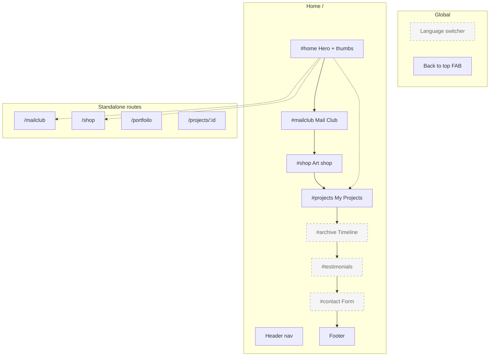
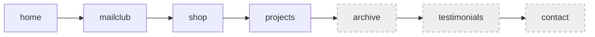

# Site visibility & structure

> **자동 생성 파일** — 직접 수정하지 마세요.  
> 숨김/보이기 변경: `src/config/siteVisibility.json` 수정 → `npm run sync:visibility`

마지막 동기화: 2026-07-27T14:44:07.886Z

## 숨김 처리 목록 (8)

| ID | 종류 | 라벨 | 위치 | 파일 |
| --- | --- | --- | --- | --- |
| `languageSwitcher` | global | Language switcher (EN / DK / KO) | Global · fixed top-right | `src/components/LanguageSwitcher.astro` |
| `nav.contact` | nav | Contact Me (header nav) | Home · header | `src/pages/index.astro` |
| `nav.resume` | nav | Resume button | Home · header | `src/pages/index.astro` |
| `section.archive` | section | Timeline & studio (archive + Hygge Time CV) | Home · #archive | `src/pages/index.astro` |
| `section.testimonials` | section | My Testimonial | Home · #testimonials | `src/pages/index.astro` |
| `section.contact` | section | Contact form & Let's talk | Home · #contact | `src/pages/index.astro` |
| `artShop.productThumbnails` | section | Art shop product thumbnail grid _Replaced with “Coming Soon..” placeholder_ | Home · #shop (below hero) | `src/components/ArtShopSection.astro` |
| `projects.thumbnails` | section | My Projects thumbnail grid _Replaced with “Coming Soon..” placeholder_ | Home · #projects (below title) | `src/pages/index.astro` |

## 표시 중 (0)

| ID | 종류 | 라벨 | 위치 |
| --- | --- | --- | --- |
| _(없음)_ | | | |

## 페이지 구조 (시각화)

## Home 섹션 순서

## 라우트

| Path | 설명 | 공개 |
| --- | --- | --- |
| `/` | Home | ✓ |
| `/mailclub` | Mail Club subpage | ✓ |
| `/shop` | Art shop subpage | ✓ |
| `/portfoilo` | PortFoilo subpage — Not linked from hero; portfolio thumb → #projects | ✓ |
| `/projects/[id]` | Project detail (placeholder) | ✓ |

## 작업 방법

1. `src/config/siteVisibility.json`에서 해당 `id`의 `hidden`을 `true` / `false`로 변경
2. `npm run sync:visibility` 실행 (또는 `npm run build` — prebuild에서 자동 실행)
3. UI는 `isHidden(id)` / `hiddenClass(id)` (`src/config/siteVisibility.ts`)를 사용하는 컴포넌트에 반영
